# ☁️ OpenStack Private Cloud Infrastructure
> A fully functional private cloud environment deployed locally using OpenStack (DevStack), featuring IaaS, SaaS, Infrastructure as Code with Terraform, and automated SLA monitoring.


---

## 📋 Table of Contents
- [Overview](#overview)
- [Architecture](#architecture)
- [Technologies Used](#technologies-used)
- [Project Structure](#project-structure)
- [Part 1 - OpenStack Deployment](#part-1---openstack-deployment)
- [Part 2 - Infrastructure as Code](#part-2---infrastructure-as-code-terraform)
- [Part 3 - SLA Monitoring](#part-3---sla-monitoring)
- [SLA Dashboard](#sla-dashboard)
- [Results](#results)

---

## 🎯 Overview

This project demonstrates the complete lifecycle of a private cloud infrastructure:

| Component | Technology | Description |
|---|---|---|
| Cloud Platform | OpenStack (DevStack) | Private cloud environment |
| IaaS | Nova + Neutron | CirrOS VM deployment |
| SaaS | Flask + Python | Student Management CRUD app |
| IaC | Terraform | Automated VM provisioning |
| Monitoring | Python + OpenStack SDK | SLA compliance tracking |
| Dashboard | Python HTTP Server | Real-time availability display |

---

## 🏗️ Architecture

```
Windows 11 Host (VirtualBox)
└── Ubuntu Server 22.04 (192.168.56.102)
    └── OpenStack (DevStack 2026.2)
        ├── Keystone  → Authentication
        ├── Nova      → Compute (VM management)
        ├── Neutron   → Networking (OVN)
        ├── Glance    → Image service
        └── Horizon   → Web dashboard
            ├── my-cirros        (IaaS - CirrOS VM)
            ├── SaaS-Ubuntu-20   (SaaS - Flask App)
            └── Terraform-CentOS (IaC - Auto-provisioned)
```

> **Screenshot: Architecture Diagram / Horizon Dashboard Overview**
> 
> 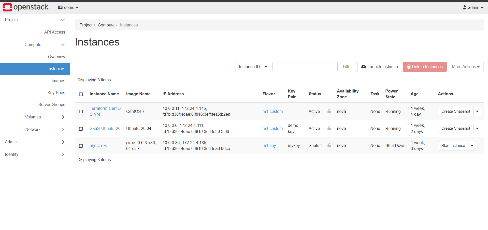

---

## 🛠️ Technologies Used

```
Cloud:          OpenStack, DevStack 2026.2
Compute:        Nova, KVM/QEMU
Networking:     Neutron, OVN, Floating IPs
Auth:           Keystone
Images:         Glance, CirrOS, Ubuntu 20.04, CentOS 7
IaC:            Terraform 1.7.5, HCL
Backend:        Python 3.8/3.10, Flask 2.1.3
Monitoring:     OpenStack SDK, Cron
Virtualization: VirtualBox, VMware
OS:             Ubuntu Server 22.04, Ubuntu 20.04, CentOS 7, CirrOS
Tools:          PuTTY, SSH, Git, Nano
```

---

## 📁 Project Structure

```
openstack-private-cloud/
│
├── README.md
│
├── terraform/
│   └── main.tf                  # Terraform IaC configuration
│
├── monitoring/
│   ├── monitor_sla.py           # SLA monitoring script
│   ├── sla.json                 # SLA contract + report
│   ├── alerts.json              # Alert history
│   └── dashboard.py             # Web dashboard server
│
├── saas/
│   └── app.py                   # Flask CRUD web application
│
└── screenshots/
    ├── horizon_dashboard.png
    ├── cirros_vm.png
    ├── flask_app.png
    ├── terraform_apply.png
    ├── sla_success.png
    ├── sla_violation.png
    └── dashboard.png
```

---

## Part 1 - OpenStack Deployment

### 1.1 Installation

OpenStack was deployed on Ubuntu Server 22.04 using DevStack inside VirtualBox.

```bash
# Create stack user
sudo useradd -s /bin/bash -d /opt/stack -m stack
sudo chmod +x /opt/stack
echo "stack ALL=(ALL) NOPASSWD: ALL" | sudo tee /etc/sudoers.d/stack
sudo su - stack

# Clone DevStack
git clone https://opendev.org/openstack/devstack
cd devstack
```

**local.conf configuration:**
```ini
[[local|localrc]]
ADMIN_PASSWORD=admin
DATABASE_PASSWORD=admin
RABBIT_PASSWORD=admin
SERVICE_PASSWORD=admin
HOST_IP=192.168.56.102
```

```bash
# Deploy (takes ~30 minutes)
./stack.sh
```

> **Screenshot: Successful DevStack Installation**
>
> 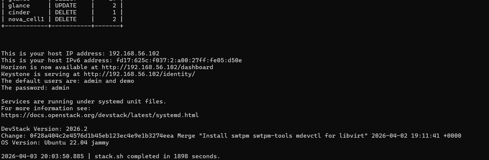

---

### 1.2 Service Verification

```bash
source ~/devstack/openrc admin admin

# Verify Nova (Compute)
openstack compute service list

# Verify Neutron (Network)
openstack network agent list

# Verify images
openstack image list
```

> **Screenshot: OpenStack Services Running**
>
> 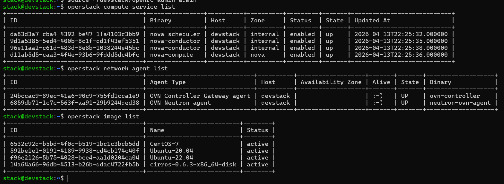

---

### 1.3 IaaS — CirrOS VM Deployment

```bash
# Create keypair
openstack keypair create --private-key ~/.ssh/mykey.pem mykey

# Create security group
openstack security group create mysg --description "My security group"
openstack security group rule create --protocol tcp --dst-port 22 mysg
openstack security group rule create --protocol icmp mysg

# Deploy CirrOS VM
openstack server create \
  --image cirros-0.6.3-x86_64-disk \
  --flavor m1.tiny \
  --key-name mykey \
  --security-group mysg \
  --network private \
  my-cirros-vm
```

> **Screenshot: CirrOS VM Running in Horizon**
>
> 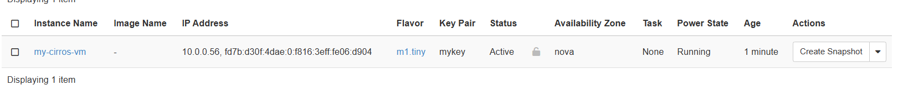

> **Screenshot: SSH Connection to CirrOS VM**
>
> 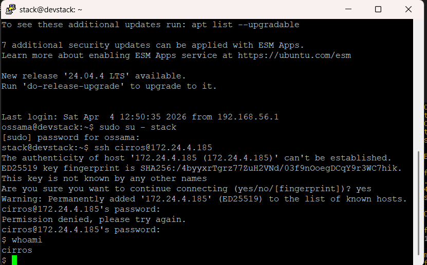

---

### 1.4 SaaS — Flask Student Management App

A full CRUD web application deployed on Ubuntu 20.04 inside OpenStack.

**Features:**
- Add / View / Delete student records
- REST API endpoints
- Real-time statistics dashboard
- Accessible via browser through floating IP

```bash
# Run the Flask app
PYTHONPATH=~ python3 ~/app.py
# Access at http://172.24.4.111:5000
```

> **Screenshot: Flask App Running in Browser**
>
> 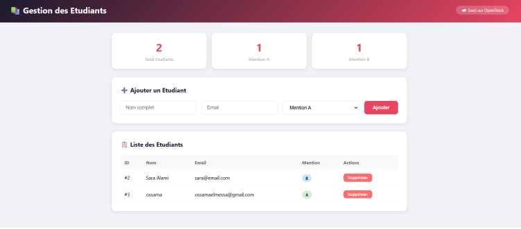

---

## Part 2 - Infrastructure as Code (Terraform)

### main.tf

```hcl
terraform {
  required_providers {
    openstack = {
      source  = "terraform-provider-openstack/openstack"
      version = "~> 1.53.0"
    }
  }
}

provider "openstack" {
  auth_url    = "http://192.168.56.102/identity/v3"
  user_name   = "demo"
  password    = "admin"
  tenant_name = "demo"
  region      = "RegionOne"
}

resource "openstack_compute_instance_v2" "centos_vm" {
  name         = "Terraform-CentOS-VM"
  image_name   = "CentOS-7"
  flavor_name  = "m1.custom"
  config_drive = true

  network {
    name = "private"
  }
}
```

```bash
# Initialize and deploy
terraform init
terraform apply
```

> **Screenshot: terraform init Output**
>
> 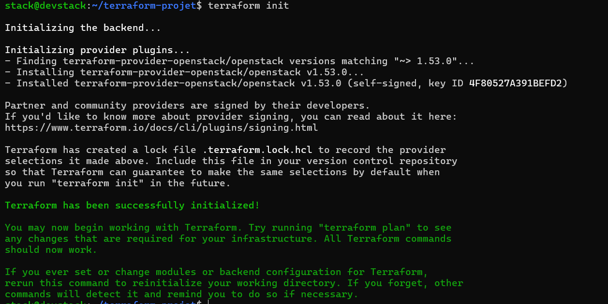

> **Screenshot: terraform apply Output**
>
> 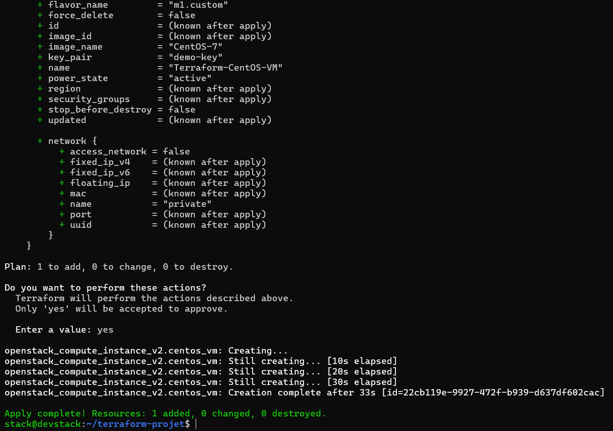

> **Screenshot: CentOS VM Created in Horizon**
>
> 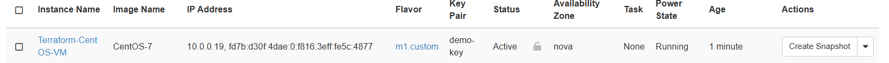

---

## Part 3 - SLA Monitoring

### SLA Contract (sla.json)

```json
{
    "service_name": "OpenStack Instance Monitor",
    "target_availability_percentage": 99.5,
    "evaluation_period": "Daily",
    "status": "Operational",
    "report": {
        "last_check": "2026-04-13 21:34:35",
        "total_vms": 3,
        "active_vms": 3,
        "current_availability": "100.0%",
        "objective_met": "SUCCESS"
    },
    "history": []
}
```

### How the Monitor Works

```
Every 5 minutes (cron)
        ↓
Authenticate with Keystone
        ↓
Get all VMs from Nova API
        ↓
Calculate availability %
(active_vms / total_vms × 100)
        ↓
Compare with 99.5% target
        ↓
Update sla.json + alerts.json
        ↓
SUCCESS ✅ or FAILED ❌
```

### Cron Configuration

```bash
# Runs every 5 minutes automatically
*/5 * * * * flock -n /tmp/monitor.lock /usr/bin/python3 \
  /opt/stack/openstack-monitoring/monitor_sla.py \
  >> /opt/stack/openstack-monitoring/log.txt 2>&1
```

> **Screenshot: Monitor Running — SUCCESS (100% availability)**
>
> 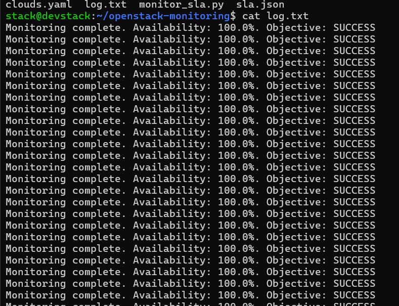

---

### SLA Violation Simulation

To test the monitoring system, a VM was intentionally shut down:

```bash
# Simulate failure
openstack server stop my-cirros-vm

# Monitor detects: 2/3 VMs active = 66.67% → FAILED ❌
```

> **Screenshot: SLA Violation Detected (66.67%)**
>
> 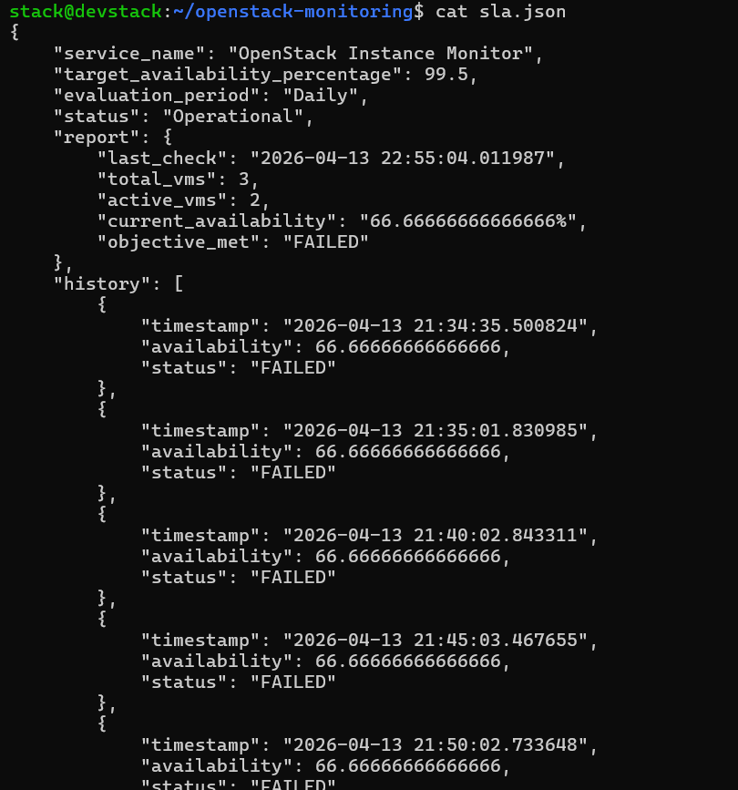

> **Screenshot: alerts.json showing violation**
>
> 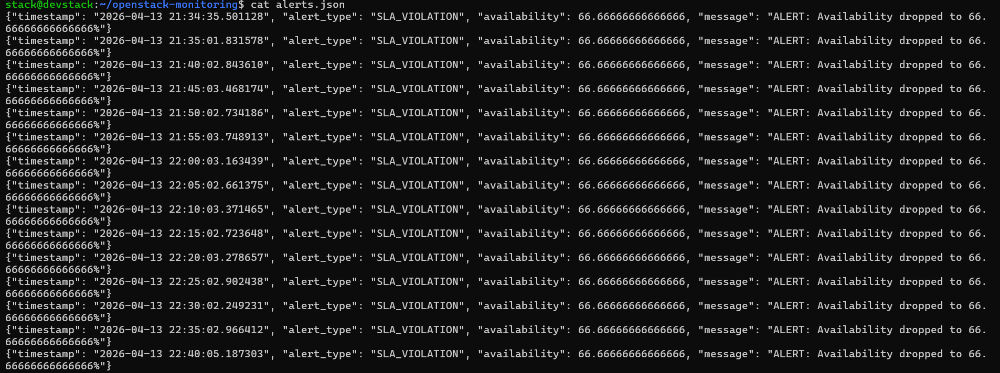

---

## 📊 SLA Dashboard

A real-time web dashboard displaying availability metrics, history, and alerts.

```bash
# Run the dashboard
python3 ~/dashboard.py
# Access at http://192.168.56.102:8080
```

**Features:**
- Live availability percentage
- SLA compliance status
- Progress bar vs 99.5% target
- Last 10 checks history
- Last 5 alerts
- Auto-refresh every 30 seconds

> **Screenshot: SLA Dashboard**
>
> 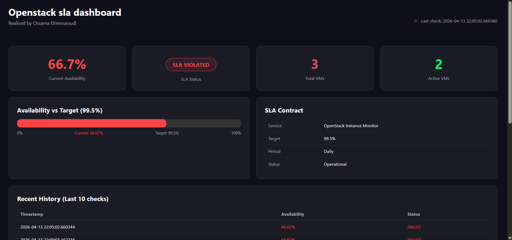

---

## 📈 Results

| Metric | Value |
|---|---|
| OpenStack Installation Time | 1898 seconds (~32 min) |
| VMs Deployed | 3 (CirrOS, Ubuntu, CentOS) |
| SLA Target | 99.5% availability |
| Normal Availability | 100% ✅ |
| Simulated Violation | 66.67% ❌ |
| Monitoring Interval | Every 5 minutes |
| Terraform Deployment Time | ~33 seconds |

---

## 👨‍💻 Author

**Ossama Elmessaoudi**  
Faculty of Sciences and Techniques of Tangier (FSTT)  
Université Abdelmalek Essaâdi  
Module: Virtualization Technologies Applied to Cloud and Edge Computing  
Professor: Prof. C. El Amrani  
Academic Year: 2025-2026

---

## 📄 License

This project was developed for academic purposes at FSTT.